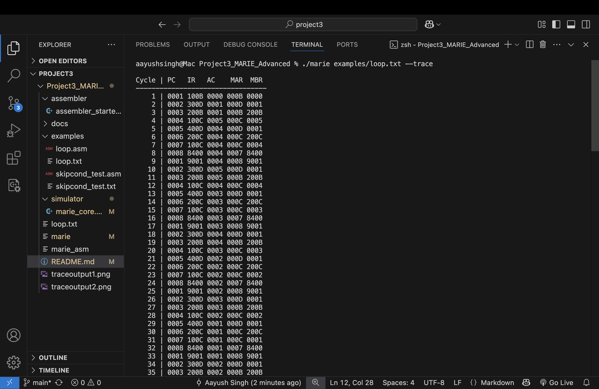
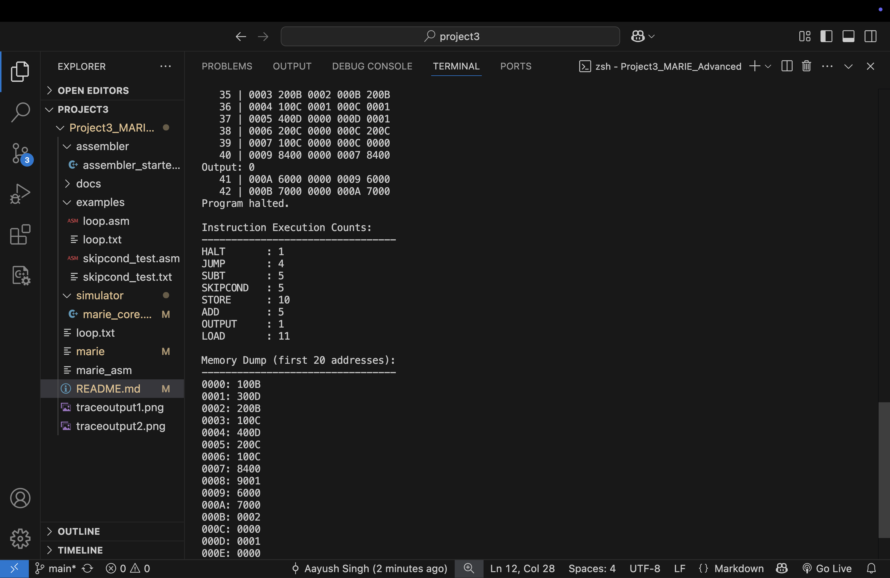
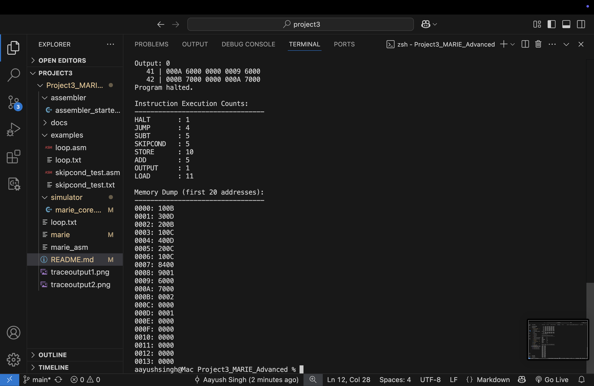

Title: Project 3 — MARIE Micro-Computer System (Advanced)
Github: https://github.com/singhaayush01/MARIE-Microcomputer-System

Name: Aayush Kumar Singh
Course: CSIS 3740 — Computer Organization
Instructor: Dr. Hailong Jiang

🔹 1. Objectives

This project focused on understanding how the MARIE CPU fetches, decodes, and executes instructions. I implemented the SKIPCOND instruction and added a new CLEAR instruction, while completing a two-pass assembler and CPU simulator in C++.

🔹 2. Implementation Summary

Assembler: Added full SKIPCOND encoding (LT, ZE, GT) and label handling.

Simulator: Implemented instruction execution and condition skipping.

Extra Instruction: CLEAR (0xB) resets the accumulator (AC ← 0).

Testing: Used loop.asm and skipcond_test.asm; verified output and trace table matched expected results.

🔹 3. Results

The assembler generated correct machine code identical to the provided reference (loop.txt).

The simulator executed programs accurately, showing correct PC, IR, AC, MAR, MBR values in the trace output.

skipcond_test.asm successfully skipped the intended instruction when AC > 0.

🔹 4. Reflection

Through this project I learned how low-level instruction decoding and control logic operate inside a CPU. Writing a two-pass assembler improved my understanding of label resolution and instruction encoding. Implementing SKIPCOND helped me connect Boolean conditions to micro-architectural control flow. Overall, this project deepened my grasp of how hardware 
executes assembly instructions step-by-step.

🔹 5. Bonus Features (+10 Points)

This project includes two optional bonus extensions to the MARIE simulator — both fully implemented and demonstrated below.

🧠 1️⃣ Instruction Execution Summary

After the program halts, the simulator automatically prints how many times each instruction was executed.
This feature helps visualize instruction usage patterns and CPU performance.

✅ How to Enable

No special flags are needed.
Simply run the simulator as normal:

./marie examples/loop.txt --trace

After the “Program halted.” message, both instruction summary and memory dump will appear automatically.

💡 Why It Matters

These features go beyond the base requirements:

Provide internal CPU statistics

Help visualize MARIE’s memory and control flow

Fulfill the project’s bonus requirement (+10 points) for extensions

🔹 6. Screenshots / Evidence
Below is a sample of the trace table generated by the MARIE simulator:

